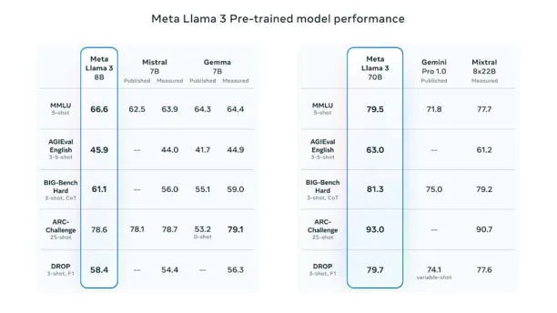
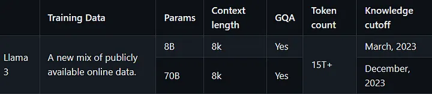
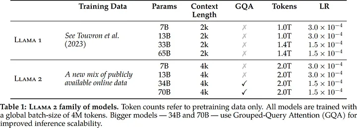
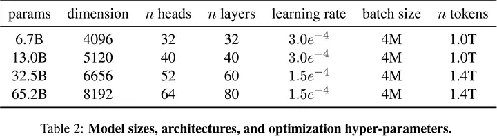

# What is Llama 3?
Meta launched Llama 3, the latest in its Llama series of open-source AI models. Llama 3 comes in two variants: one with 8 billion parameters and another with 70 billion parameters.
Meta claims that Llama 3 sets a new standard for large language models at these parameter scales. They have improved pretraining and post-training processes, resulting in reduced false refusal rates, better alignment, and more diverse responses from the model. Notably, Llama 3 boasts enhanced capabilities in reasoning, code generation, and instruction following.

## Technical Specs
LLaMA Architecture :
The key difference between the predecessors models is, the size of the pretraining corpus increased by 650% LLaMA — 2 was trained on 2T tokens where as LLaMA — 3 trained on 15T tokens, doubled the context length of the model from 4K to 8K on both 8B and 70B models, and adopted grouped-query attention for both 8B and 70B variant as compared to the previous generation (GQA) was only used in bigger models 34B and 70B. The most impactful part I felt was new approach to safety with two rewards models for Safety and Helpfulness.
LLaMA 3 imbibes it’s Architecture from its previous generation models
LLaMA 3 :
Model size, Architectures, optimization hyper-parameters

  

LLaMA 2 :

 

LLaMA 1 :

 

LLaMA Architecture:

 

